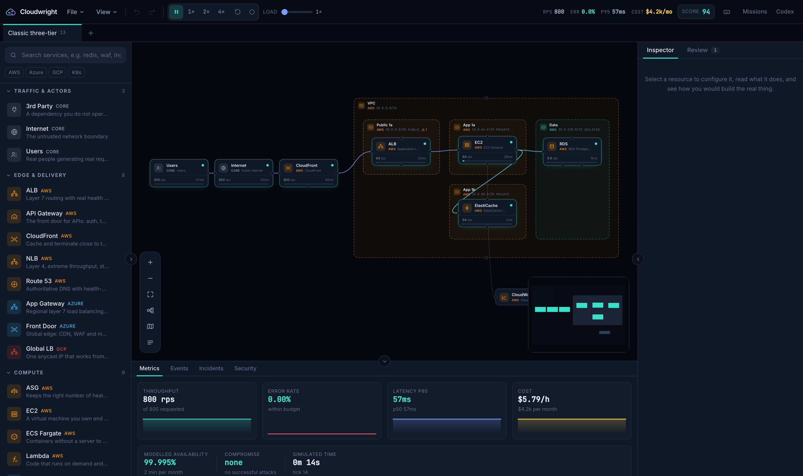
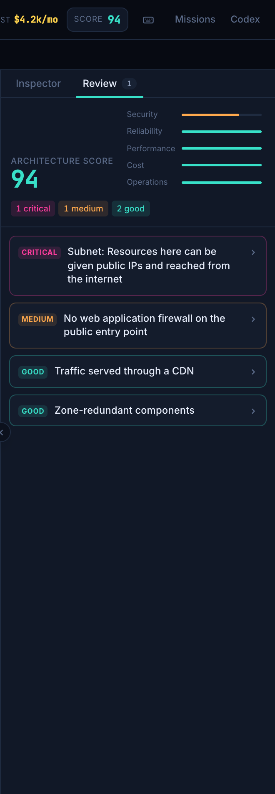
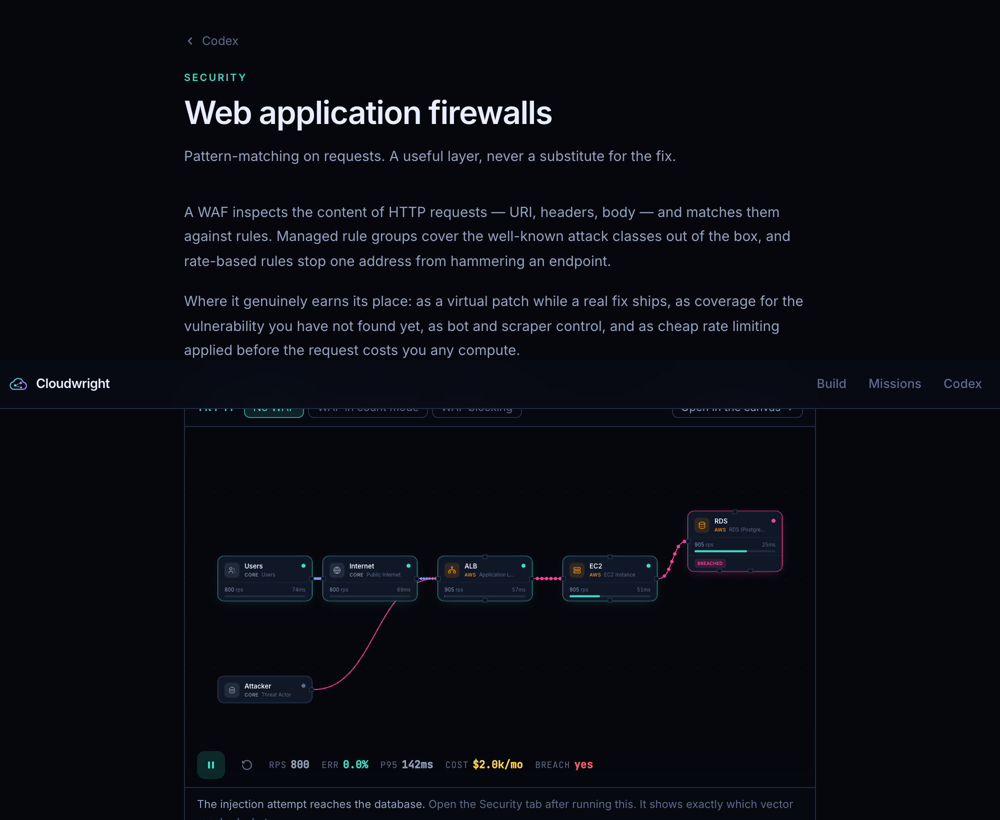
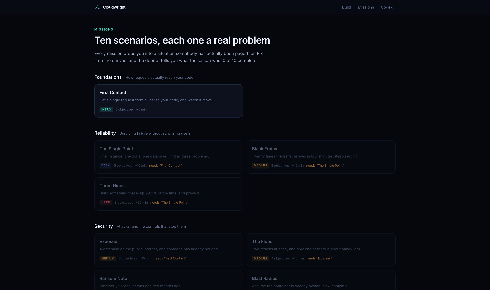

<div align="center">

# Cloudwright

### Build the cloud. Break it. Defend it.

A browser game for learning cloud infrastructure, DevOps, Kubernetes and security —
by building real architectures, running traffic through them, and finding out what breaks.

**[▶ Try it — cloudwright.pages.dev](https://cloudwright.pages.dev)**

No sign-up, no backend, nothing to install. Everything runs in your browser.

[](LICENSE)
[](https://cloudwright.pages.dev)
[](#driving-it-from-an-llm)



</div>

---

## Why this exists

Cloud infrastructure is a pile of trade-offs that nobody writes down. Redundancy against
cost. Consistency against latency. Control against operational load. You can read about
them — or you can move a slider and watch the error rate climb.

Cloudwright is the second one. It is a free-form canvas, like a diagram tool, except the
diagram is *alive*: connections that make no sense in reality refuse to form, traffic
actually flows through what you build, and the numbers respond to the decisions you make.

**75 services** across AWS, Azure, GCP and Kubernetes · **162 codex entries** · **15 missions** · **93 tests**

---

## What it does

### Connections that refuse to lie

Drag a line from the public internet to a database and it will not connect. Instead it
explains why, in terms of route tables, wire protocols and the incidents that follow:

> **The public internet cannot reach a database directly.** A database speaks SQL on a
> private port, not HTTP. Exposing one to the internet is how credential-stuffing and
> ransomware incidents start. Production databases sit in a private subnet with no route
> to an internet gateway.
> *Hint: route through a load balancer → compute tier → database.*

Every refusal is a lesson you did not have to read a book for.

### A simulation that models the actual trade-offs

Requests flow from clients through your graph. Latency climbs non-linearly with
utilisation — barely at all up to 70%, steeply past 90% — because that is how queues
behave. Caches absorb reads. CDNs absorb hits. Autoscaling arrives a minute late, because
it does.

The engine is deterministic and pure, which means the emergent behaviour is trustworthy.
My favourite is preserved as a test:

> *Scaling a tier that is not the bottleneck changes the error rate by exactly nothing,
> and the bill by a lot.*

### Break it on purpose



Inject an OOM kill, a zone outage, a cache stampede, a hot partition, an expired
certificate, connection exhaustion. Each is a real failure mode attached to the resource
it belongs to, with the symptom you would actually see in metrics and the remedy that
fixes it.

Then diagnose it from the event log and the charts, and fix the *architecture* rather
than the incident.

### Attacks with real defences

Volumetric and application-layer DDoS, SQL injection, SSRF, credential stuffing, lateral
movement, exfiltration, ransomware. Each walks your graph and is blunted — or not — by
the controls it meets **and how you configured them**. Thirty-day backups genuinely
reduce ransomware pressure. IMDSv2 genuinely closes the SSRF credential path. Defence in
depth stops being a slogan and becomes a number you can watch fall.

### A live architecture review

A Well-Architected-style analysis runs continuously across security, reliability,
performance, cost and operations. Every finding explains what is wrong, why it matters,
and what to do — in the voice of someone who has been paged for it.

<br clear="right">

### How to build it for real

Every resource carries the console steps, the CLI commands, the Terraform, the official
documentation link, and the operational gotchas that catch people:

> *Multi-AZ failover takes 60–120 seconds and existing connections are severed. Your
> application needs retry logic or the failover is still an outage, just a shorter one.*

### One idea, three clouds

Every service maps to a provider-agnostic archetype, so the AWS, Azure and GCP
equivalents sit side by side. Learn the shape once; it transfers.

---

## The codex



162 entries covering networking, compute, data, reliability, security, operations,
platform engineering and Kubernetes — the ground a cloud engineer, a platform engineer, a
DevOps engineer and an SRE each stand on. Several carry interactive explainers — an OSI layer browser, a CIDR
calculator, a TLS handshake walkthrough, an availability-maths calculator, an error
budget burn-rate tool.

Every entry embeds a **runnable** illustration: usually the same architecture twice, with
and without the thing the entry is about. Caching is not something you are told removes
85% of database load. It is something you watch remove it.

## The campaign



Fifteen scenarios built around problems people have actually been paged for — an exposed
database, a Black Friday spike, a CrashLoopBackOff, a ransomware event, a bill nobody can
explain, a pager that fires all night and stays silent through the real outage, a golden
path forty teams will copy. Each has objectives evaluated live against your architecture, progressive hints,
and a debrief that states the lesson plainly.

Every mission is **proven winnable by a test**, because an objective that quietly becomes
impossible is the kind of bug you cannot find by hand. That test has already caught three.

---

## Driving it from an LLM

Cloudwright ships an **MCP server** that exposes the catalog, the simulator, the reviewer
and the renderer. A model can design an architecture, find out whether it actually serves
the traffic, read what a senior engineer would say about it — and then *look at a
screenshot of its own work*.

```bash
npm run build && npm run mcp      # stdio, for a desktop MCP client
npm run dev -- --enable-mcp       # …or streamable HTTP at /mcp while developing
docker compose up --build         # …or both, on :8080
```

```json
{
  "mcpServers": {
    "cloudwright": { "command": "node", "args": ["/path/to/cloudwright/dist-mcp/stdio.mjs"] }
  }
}
```

| Tool | What it does |
| --- | --- |
| `list_resources` · `describe_resource` | The catalog, including every property with its default, options, and what changing it does |
| `list_archetypes` | The same service across all four providers — the translation table |
| `suggest_ports` · `validate_connection` | Whether two resources can connect, and the reasoning either way |
| `create_diagram` | Builds an architecture from a description — ports resolved and layout computed, so no port ids or coordinates needed |
| `simulate` | Throughput, errors, latency, cost, availability, per-node state |
| `review_diagram` | The five-pillar architecture review |
| `compare_diagrams` | Two architectures side by side with deltas — *is this change actually better?* |
| `screenshot_diagram` | A PNG rendered by the real application, in either theme, plus the simulation state |
| `record_video` | An MP4 of a run, with failures injected on a timeline so the video tells a story |
| `list_failure_modes` · `list_attack_vectors` | Everything that can break, and every attack modelled |
| `list_concepts` · `get_concept` · `list_missions` · `get_mission` · `list_templates` | The written material and the scenarios |
| `share_url` · `arrange_diagram` | A link that opens the diagram; automatic layout |

An illegal connection does not produce a broken file — it comes back with the same
explanation a player sees, which is usually the answer to the design question that was
really being asked.

---

## Running it

```bash
npm install
npm run dev        # http://localhost:5173
npm run check      # typecheck + lint + 93 tests
npm run build      # dist/ (app) and dist-mcp/ (MCP server)
```

### With Docker

One container serves the app and the MCP endpoint, and the renderer drives the very app
it is serving:

```bash
docker compose up --build
#  app  http://localhost:8080
#  mcp  http://localhost:8080/mcp
```

The image bundles Chromium and ffmpeg so the screenshot and video tools work out of the
box, which makes it large (~1.8GB). Everything else works without them.

### Deploying

Static files — Cloudflare Pages, Netlify, GitHub Pages, any bucket. This one runs on
Cloudflare Pages:

```bash
npm run deploy     # builds and uploads to cloudwright.pages.dev
```

Or connect the repository in the Cloudflare dashboard for a deploy on every push:

| Setting | Value |
| --- | --- |
| Build command | `npm run build` |
| Output directory | `dist` |

`public/_redirects` gives the SPA its client-side routing fallback and `public/_headers`
sets security headers and immutable asset caching. Both are copied into `dist/`.

---

## How it is built

React · TypeScript · Vite · React Flow · Zustand · Tailwind. No backend, no database, no
analytics. Diagrams live in your browser, or compressed into a share link.

```
src/
  catalog/      Every cloud service, as data — the largest and most valuable part
  sim/          The engine: pure, deterministic, no React
  canvas/       React Flow integration: nodes, animated edges, layout
  panels/       Palette, inspector, review, observability
  codex/        The written material, interactive widgets and runnable demos
  scenarios/    Missions, reference templates, objective evaluation
mcp/            MCP server: tools, transports, browser rendering
tests/          Catalog validation, engine behaviour, mission solvability
```

**Two ideas hold it together.**

*Archetypes.* The simulator never reasons about `aws.ec2` versus `azure.vm`. It reasons
about the archetype `vm`. The engine stays small, every new resource works on the day it
is added, and the cross-provider comparison falls out for free.

*The catalog is the single source of truth.* One `ResourceDef` supplies the palette entry,
the canvas node, the ports and connection rules, the property editor, the cost model, the
failure modes, the security profile and the build guide. Nothing is duplicated, so nothing
can drift.

---

## Contributing

Adding a cloud service is **one file**:

```ts
const myService: ResourceDef = {
  id: 'aws.my-service',          // never rename: share links reference it
  provider: 'aws',
  short: 'MyService',            // shown on the node
  archetype: 'queue',            // how the simulator treats it
  category: 'messaging',
  tagline: 'One line for the palette',
  description: 'A paragraph explaining it in plain language.',
  ports: [inPort('in', 'Messages in', ['queue']), outPort('out', 'Messages out', ['queue'])],
  props: [/* each with `help`, `impact`, and `danger` where it matters */],
  sim: { capacity: 10_000, latencyMs: 12, failureModes: [/* … */] },
  cost: { perMillionRequests: () => 0.4 },
  setup: { console: [], snippets: [], docs: [], gotchas: [] },
}
```

The palette, canvas, inspector, simulation, cost model and advisor all pick it up. Tests
validate the structure. [`CLAUDE.md`](CLAUDE.md) has the full guide — house style, the
traps that have bitten before, and how to add a codex entry or a mission.

Corrections to the technical content are especially welcome. The whole value of this
project is that what it teaches is true.

---

## Accuracy

Costs, capacities and latencies are **simplified teaching figures** chosen to make
trade-offs visible — not quotes. Always check the provider's own calculator before
spending money. Service behaviour, failure modes and remediation advice aim to be
accurate; if you spot something wrong, please open an issue.

Not affiliated with Amazon, Microsoft, Google or the CNCF. Resource icons are original
geometric drawings, not the providers' trademarked icon sets.

## Licence

[MIT](LICENSE)
